# Part 1

## Question 1
**a. Given the current contents of the IP forwarding table, what do you suspect will happen when you attempt to send an IP datagram from a to b (10.0.0.2)?**

The content of the forwarding table is shown in the following code block:
```
10.0.0.0/24 dev a-s1 proto kernel scope link src 10.0.0.1
```
This entry means that any IP destination that matches `10.0.0.0/24` will be sent to `a-s1`, and this entry has no next hop. 

When you send a IP datagram from `a` to `b` (destination IP = `10.0.0.2`), it will match with the network range specified by `10.0.0.0/24`, so it will be sent to `a-s1`. The last part says that the source IP will be set to `10.0.0.1`. Because `b` is under the same subnet, it should directly be sent to `b` without further routing.

**b. Given the current contents of the IP forwarding table, what do you suspect will happen when you attempt to send an IP datagram from a to c (10.0.1.2)?**

`10.0.1.2` does not match with `10.0.0.0/24`, so the packet will not be sent to `a-s1`. Because there are no other remainint entries in the forwarding table, the the device will send it to the default route. However, since no default route is specified, it is dropped. 

**c. What are the current contents of `a`'s ARP table?**

ARP's functionality is to translate IP addresses to physcial addresses. In the case of `a`, running `ip neigh` reveals the ARP table, and there is nothing. 

## Question 2
The Wireshark window after `ping -c 1 -W 1 10.0.0.2` from host `a`.
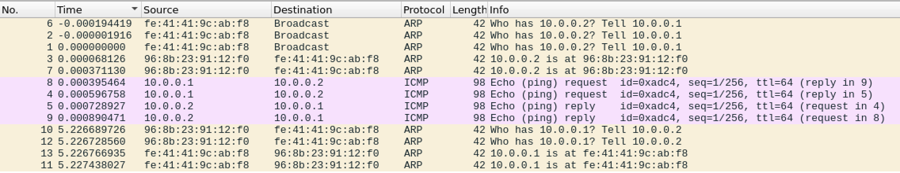
**a. Consider the very first (in terms of time) frame sent from `a`. What was the protocol and the purpose of the packet carried by that frame?**

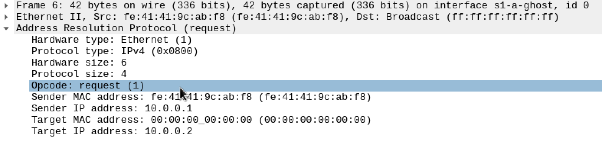
The first frame sent from `a` was an Address Response Protocol (ARP) request. The purpose of this packet is to broadcast (`ff:ff:ff:ff:ff:ff`) to all the devices on the network to ask for the MAC address of the device associated with the IP address `10.0.0.2`, which is the target IP address. Essentially, its goal is to resolve the MAC address from an IP address. 

**b. Which of all the hosts or routers connected to s1 or s2 observed this first frame from a? Use the rows in the "packet list" window to answer the question.**

Host `b` and router `r1` observed the first frame.

**c. Briefly explain your answer to part b. That is, why did this set of hosts get the frame (no more, no less)?**

The message traversed the interfaces `s1-a`, `s1-b`, `s1-r1`. The first interface traversed was  `s1-a`, so `s1` interface will broadcast it to all its connected nodes (`r1` via `s1-r1` and `b` via `s1-b`). When it sent it to host `b` with MAC address (`96:8b:23:91:12:f0`), it will find that its IP address (`10.0.0.2/24`) matches `10.0.0.2`, which was the target IP of the ARP request sent out; however, this is the last node, so it will not send it anywhere else. When the broadcast was sent to `s1-r1`, this router found no other matches in its routing table besides `s1`, which is why no other hosts will get the frame. 

**d. Which of all the hosts or routers connected to s1 or s2 observed the response from from b?**

Host `a` observed the response from `b`.

**e. Briefly explain your answer to part d. That is, why did this set of hosts get the frame (no more, no less)?**

Since host `b`'s response is intended to send to its target IP `10.0.0.1`, its routing table would have found a match and will forward it to the link `s1-a`. Since host `a` is the only host that matches this desired IP address, it will be the only one that observes the response.

**f. Was the ping successful? That is, did you get a response?**

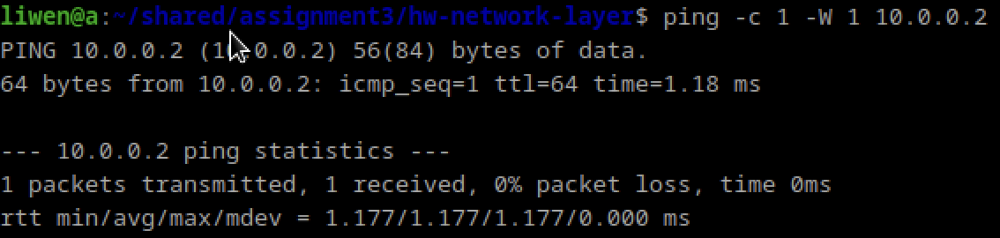
The ping was successful. Host `a` received a response. Host `b` sent it the rtt of the interaction and a few othehr details. The response is shown in the screenshot above. 

## Question 3
**What entries are in the table when you re-run the `ip neigh` command to see the new state of a's ARP table?**

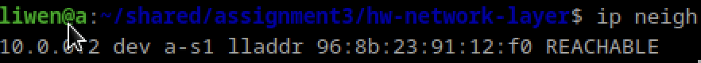
The new ARP table has one entry: `10.0.0.2 dev a-s1 lladdr 96:8b:23:91:12:f0 REACHABLE` which associates the IP address `10.0.0.2` with the MAC address `96:8b:23:91:12:f0`. This table entry was added because of the ARP request and response. 


## Question 4
Now run the following command on `a` to send a single packet from `a` to `c`: `ping -c 1 -W 1 10.0.1.2`

**a. Was the ping successful? That is, did you get a response?**
The ping was not successful because there was no response. It says that `Network is unreachable`.

**b. Which of all the hosts or routers connected to s1 or s2 observed frame(s) associated with the ping command you just issued?**
None of the frames observed the frames associated with the ping. This is because there is no entry in the routing table that would match with `10.0.1.2`. However, if there was a route, host `c` would have responded.

## Question 5

**Identify the IP prefix, the next hop IP address, and the outgoing interface to create a default route for `a` using `r1`. Then add that entry to `a`'s forwarding table, using the command and description above. Show the command that you used.**

The IP prefix needs to be the default route which is `0.0.0.0/0`, the next hop IP address should be of `s1` which is `10.0.0.3` because this is the address to reach `r1` from `s1`, and interface is `a-s1`. Therefore the command must be: `sudo ip route add 0.0.0.0/0 via 10.0.0.3 dev a-s1`

## Question 6
Again, run the following command on `a` to send a single packet from `a` to `c`: `ping -c 1 -W 1 10.0.1.2`

**a. Consider the very first (in terms of time) frame sent from `r1` on `r1-s2`. What was the protocol and the purpose of the packet carried by that frame?**
The first frame sent from `r1` on `r1-s2` is an ARP Request. The purpose of this packet is to broadcast (`ff:ff:ff:ff:ff:ff`) to all the devices on the network to ask for the MAC address of the device associated with the IP address `10.0.1.2`, which is the target IP address. Essentially, its goal is to resolve the MAC address from an IP address. Before this moment, we had found the MAC address of router `r1`, so then the request was sent to `r1`, but `r1` doesn't know the MAC address of `10.0.0.2` which is why it sent this ARP Request.

**b. Which of all the hosts or routers connected to s1 or s2 observed this frame from r1? Use the rows in the "packet list" window to answer the question.**
Host `c` and `d`. 

**c. Briefly explain your answer to part b. That is, why did this set of hosts get the frame (no more, no less)? Hint: think about purpose of the packet, look at the addresses in the Ethernet frame header, and consider the makeup of the network.**

At this point, router `r1` knows it has to forward its request to `10.0.1.2`, but it needs to broadcast the ARP request to find the MAC address of this IP address. According to `r1`'s routing table, it will send the broadcast to `r1-s2`, where it will be broadcasted to each of its node, which include host `c` and host `d`. These hosts do not forward it anywhere else because there are no other nodes.

**d. Is it seen on any interfaces of s1? Why or why not?**
It is not seen on the interface of `s1` because router `r1` has a routing table where the only match with `10.0.1.2` is the interface `r1-s2`.

**e. Was the ping successful?**
The ping reached its destination but received no response. 
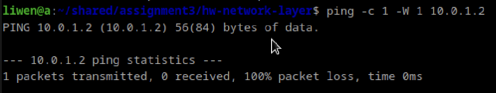

## Question 7
Run the ip neigh command on `r1` to see the state of its ARP table: `ip neigh`


**What entries are in the table?**
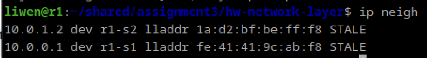
The connection is `STALE` because it timesout when a packet is sent to it. This is because there's no route from `c` to `r1`.

## Question 8
Follow the instructions from problem 5 to add the appropriate default route to host c, so it can send response messages to hosts outside its subnet. 

**Show the command you used.**
`sudo ip route add 0.0.0.0/0 via 10.0.1.1 dev c-s2`

## Question 9
Again run the following command on `a` to send a single packet from `a` to `c`: `ping -c 1 -W 1 10.0.1.2`

**Was it successful?**
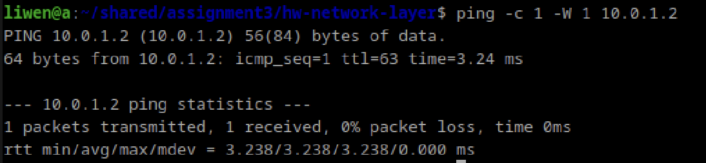
Yes the ping was successful. Host `a` recieved a response from `c`. 

## Question 10

**What is the outcome of running the following on `a` and `c`, respectively?**
```
a$ ping -c 1 -W 1 10.0.3.2
c$ ping -c 1 -W 1 10.0.3.2
```


Neither of them work. It says that the `Destination Net Unreachable`. 
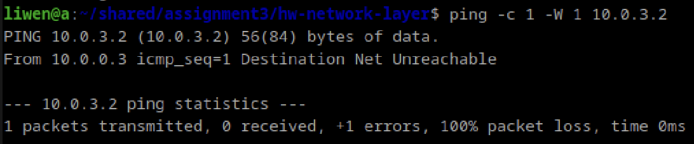
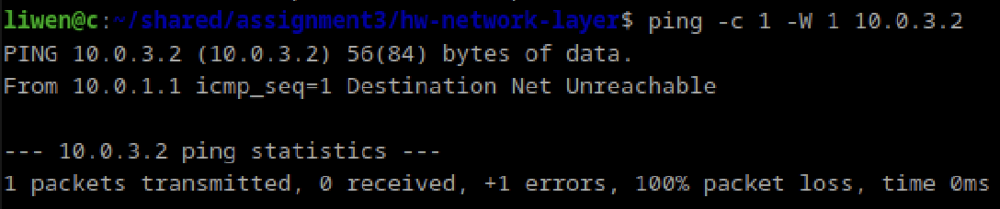

## Question 11

Take a look at the forwarding table entries for `r1` and `r2`. Note that they only have entries for the subnets for which they have interfaces. 

`r1` forwarding entries:
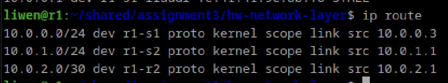

`r2` forwarding entries:
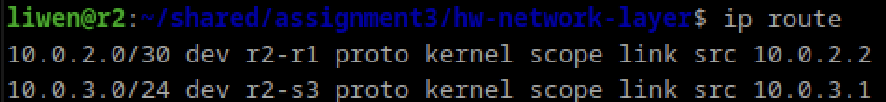

For `r1`, add entries for the specific subnets to which `r2` is directly connected, and vice-versa. You should use the ip route command that you used in question 5, but you will need to determine the appropriate IP prefixes, interface names, and next hop IP addresses, which will all be different for this one. Finally, add a forwarding entry for the default route to host e. This one will be more similar to what you did in question 5.

Taking a good look at the network diagram (i.e., net.png) will help you with this. Think carefully about what you are wanting to do in each case.

**a. Show the command you used to add the appropriate entry to r1.**
IP prefixes = `10.0.3.0/24`, interface names = `r1-r2`, and next hop IP addresses = `10.0.2.2` 

Command used: `sudo ip route add 10.0.3.0/24 via 10.0.2.2 dev r1-r2`


**b. Show the command you used to add the appropriate entries to r2.**
For subnet 1 (`s1`):
IP prefixes = `10.0.0.0/24`, interface names = `r2-r1`, and next hop IP addresses = `10.0.2.1` 
Command used: `sudo ip route add 10.0.0.0/24 via 10.0.2.1 dev r2-r1`

For subnet 2 (`s2`):
IP prefixes = `10.0.1.0/24`, interface names = `r2-r1`, and next hop IP addresses = `10.0.2.1` 

Command used: `sudo ip route add 10.0.1.0/24 via 10.0.2.1 dev r2-r1`


**c. Show the command you used to add the appropriate entry to e.**

IP prefixes = `default`, interface names = `e-s3`, and next hop IP addresses = `10.0.3.1` (router `r2`)
Command used: `sudo ip route add 0.0.0.0/0 via 10.0.3.1 dev e-s3`


## Question 12
**Now what is the outcome of running the following on a and c, respectively?**

```
a$ ping -c 1 -W 1 10.0.3.2
c$ ping -c 1 -W 1 10.0.3.2
```

Successful ping from `a` to `e`:
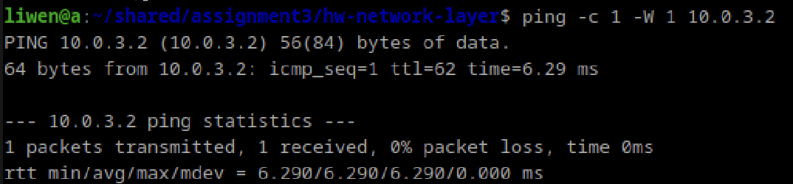


Successful ping from `c` to `e`:
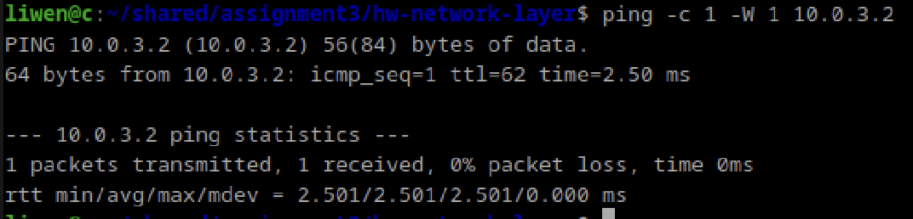

We get the reponse, with rtt information. 

# Part 2 - ICMP Error Messages and Fragmentation

## Question 13
Run the following to send an ICMP echo request/reply between `h1` and `h2`: 
```
h1$ ping -c 1 -W 1 10.0.1.2
```
**What is the TTL reported by `ping`? ** Considering that Linux, by default, uses a starting TTL of 64 for IP packets that it creates, how many hops (i.e., routers) did the ICMP echo response pass through?**

The ttl reported was `59`. Since the TTL specifies the number of hops an IP packet can travel before it is discarded, this means that it passed through $64-59 = 5$ hops. 


## Question 14
**For each part of this problem, run the given command from `h1`, look at the Wireshark capture, and then respond with 1) the host or router that sent the ICMP error and 2) *brief* description of why the ICMP error was sent. For example, if the ICMP message is "port unreachable", do not write "port unreachable" but rather "the host was not listening on the requested port".**

a. 
```
h1$ ping -c 1 -W 1 -t 3 10.0.1.2
```
(`-t` sets the starting TTL)

We received the error that the `Time to live exceeded` from the IP address `10.20.0.6`, or `r3`, because the TTL was initially set to 3 and `r3` is the third hop and by then it would not have reached its desired destination. The number of hops required to pass through to go from host `h1` to `h2` is 5. 

b.
```
h1$ ping -c 1 -W 1 10.0.1.2 
```
There was no ICMP error because there is a route to `10.0.1.2` and the TTL is sufficient. 

c.
```
h1$ ping -c 1 -W 1 10.0.1.4
```
There is a `Destination unreachable (Host unreachable)` error sent by IP address `10.20.0.14`, or router `r5`. The packet is routed all the way up to `r5` from `r1` becuase that is the `default` path. However, at `r5` when the router is sends the packet to the interface `r5-h2`, it cannot find any host that matches `10.0.1.4`, which is why its destination unreachable. 

d.
```
h1$ ping -c 1 -W 1 10.0.3.1
```
There is a `Destination unreachable (Network unreachable)` error sent by IP address `10.20.0.14`, or router `r5`. The packet is routed all the way up to `r5` from `r1` becuase that is the `default` path. However, at `r5` when the router looks through its routing table for the IP address `10.0.3.1`, it cannot find a match so it is dropped. This is why the error message is `Network unreachable` instead of `Host unrechable`.

e.
```
h1$ dig @10.0.1.2 +timeout=1 +tries=1 . NS
```
(`dig` is a command-line DNS tool.  For the purposes of this , just know that it is sending a single UDP datagram to 10.0.1.2 on port 53--and also, there is nothing listening on port  on `h2`. :) )

There is a `Destination unreachable (Port unreachable)` error sent by IP address `10.0.1.2`, or host `h2`. The packet is routed all the way up to `r5` from `r1` becuase that is the `default` path and then sent to `h2` since its IP address matchces. At `h2`, it attempts to access port 54, but there's nothing listening at `h2` so it sends this ICMP error to alert `h1`. 
    
## Question 15 
Run the following command from `h1`, which, sends an ICMP echo request of size 1500 to 10.0.1.2:

```
h1$ ping -c 1 -W 1 -s 1500 -M dont 10.0.1.2
```

**a. How many fragments result from the single IP datagram?**

There are 3 fragments in the single IP datagram.

**b. What are the sizes of each fragment?**

Each fragment has a length of `514`. 

**c. What are the offsets of each fragment?**

Fragment 1 has offset of 0, fragment 2 has offset of 480, fragment 3 has offset of 960, and fragment 4 has offset of 1440.
