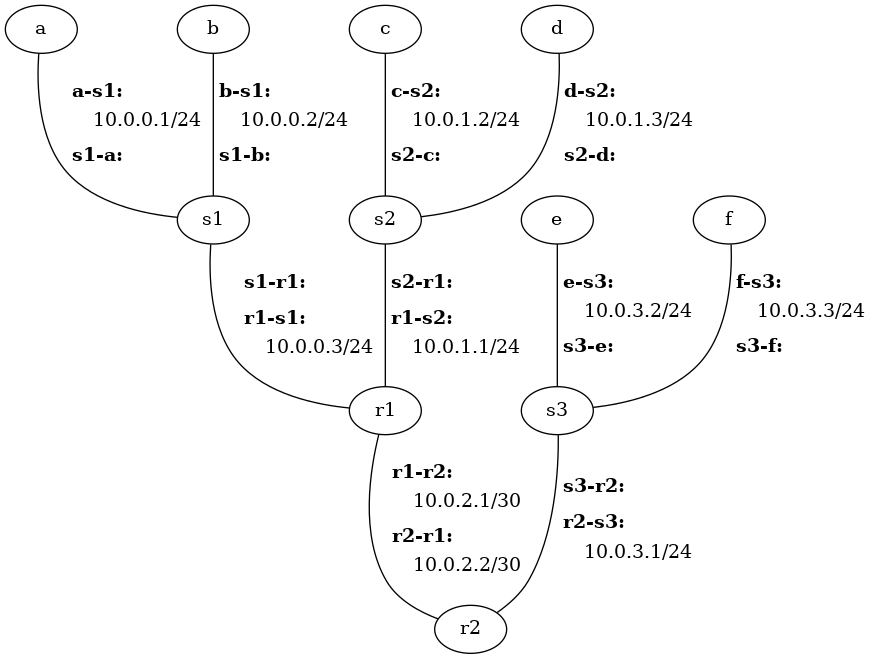
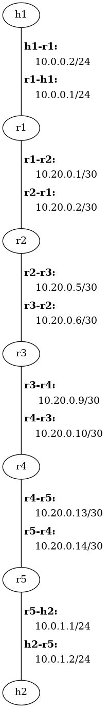

# Read these topics before completing the homework. For more information on each topic, visit the links provided.

# ICMP
Internet Control Message Protocol (ICMP) is a network layer protocol used to diagnose communication errors by performing an error control mechanism. Since IP does not have an inbuilt mechanism for sending error and control messages. It depends on Internet Control Message Protocol (ICMP) to provide error control. 
ICMP is used for reporting errors and management queries. It is a supporting protocol and is used by network devices like routers for sending error messages and operations information. For example, the requested service is not available or a host or router could not be reached.
For more details visit: https://www.geeksforgeeks.org/internet-control-message-protocol-icmp/

# MAC Address
To communicate or transfer data from one computer to another, we need an address. In computer networks, various types of addresses are introduced; each works at a different layer. A MAC address, which stands for Media Access Control Address, is a physical address that works at the Data Link Layer. 
MAC Addresses are unique 48-bit hardware numbers of a computer that are embedded into a network card (known as a Network Interface Card) during manufacturing. The MAC Address is also known as the Physical Address of a network device. In the IEEE 802 standard, the data link layer is divided into two sublayers:
1.	Logical Link Control (LLC) Sublayer
2.	Media Access Control (MAC) Sublayer

The MAC address is used by the Media Access Control (MAC) sublayer of the Data-Link Layer. MAC Address is worldwide unique since millions of network devices exist and we need to uniquely identify each

MAC addresses are often used in conjunction with ARP (Address Resolution Protocol) to resolve IP addresses to MAC addresses for communication on a LAN. An example of a MAC address is: 00-B0-D0-63-C2-26.

For more information visit: https://www.geeksforgeeks.org/mac-address-in-computer-network/

# ARP
Most computer programs/applications use logical addresses (IP Addresses) to send/receive messages. However, the actual communication happens over the Physical Address (MAC Address) that is from layer 2 of the OSI model. So our mission is to get the destination MAC Address which helps in communicating with other devices. This is where ARP comes into the picture, its functionality is to translate IP addresses to Physical Addresses.
Imagine a device that wants to communicate with others over the internet. What does ARP do? It broadcasts a packet to all the devices of the source network. The devices of the network peel the header of the data link layer from the Protocol Data Unit (PDU) called frame and transfer the packet to the network layer (layer 3 of OSI) where the network ID of the packet is validated with the destination IP’s network ID of the packet and if it’s equal then it responds to the source with the MAC address of the destination, else the packet reaches the gateway of the network and broadcasts packet to the devices it is connected with and validates their network ID. The above process continues till the second last network device in the path reaches the destination where it gets validated and ARP, in turn, responds with the destination MAC address.
For more information, visit: https://www.geeksforgeeks.org/how-address-resolution-protocol-arp-works/


# Hands-On with the Network Layer

The objectives of this assignment are to 1) gain further experience with the
Cougarnet framework developed, and 2) gain hands-on experience with IP subnets
and IP forwarding.


# Getting Started


## Update Cougarnet

Make sure you have the most up-to-date version of Cougarnet installed by
running the following in your `cougarnet` directory:

```
$ git pull
$ python3 setup.py build
$ sudo python3 setup.py install
```

Remember that you can always get the most up-to-date documentation for
Cougarnet [here](https://github.com/cdeccio/cougarnet/blob/main/README.md).


# Part 1 - ARP and IP Forwarding

## Start the Network

File `h6-r2.cfg` contains a configuration file that describes a network with
six hosts: `a` and `b` connected to router `r1` through switch `s1`; `c` and
`d` connected to a different interface of router `r1` through switch `s2`; `e`
and `f` connected to `r2` through switch `s3`; and routers `r1` and `r2`
directly connected.  There are no VLANs in this scenario.

Run the following command to create and start the network:

```bash
cougarnet --display-file=net.png --wireshark=s1-a,s1-b,s1-r1,s2-c,s2-d,s2-r1 h6-r2.cfg
```

The `--display` option tells `cougarnet` to print out the network layout before
starting all the hosts, while `--display-file=net.png` creates an image,
`net.png`, showing the layout with more network details, including IP addresses
and interface names.  This image is included here for convenience:



With the `--wireshark` option, Wireshark will be launched and will begin
capturing packets on all interfaces associated with `s1` and `s2`.

Because of the current configuration, you will only see five terminals show up,
one associated with each of hosts `a`, `c`, and `e`, and one associated with
each of routers `r1` and `r2` (you can change this with the `--terminal`
option).


## Exercises

 1. Run the following commands on host `a` to show its network interface
    configuration, IP forwarding table, and ARP table:

    ```bash
    a$ ip addr 2> /dev/null
    a$ ip route
    a$ ip neigh
    ```

    (The `2> /dev/null` simply redirects standard error, which is noisy due to
    unknown causes related to working in a private network namespace :))

    Note that while Cougarnet allows for MAC addresses to be pre-assigned in the
    [configuration file](#configuration-1), the MAC addresses assigned to each
    interface in this scenario are random.  That is demonstrate how they are
    learned through ARP, without prior knowledge.  That being said, you will
    want to take note of `a`'s MAC address for its `a-s1` interface.  It is in
    the output of `ip addr 2> /dev/null`, following `link/ether`.

    You should only see one entry in the forwarding table:
    ```
    10.0.0.0/24 dev a-s1 proto kernel scope link src 10.0.0.1
    ```

    This entry means that for IP destinations matching `10.0.0.0/24`,
    the host will send packets out interface (`dev`) `a-s1`, and that there is
    no explicit next hop--that is, the next hop is whatever the IP
    destination is.  This table entry is created automatically by the system
    when interface `a-s1` is enabled with IP address `10.0.0.1/24` because it
    now knows that it is connected to the `10.0.0.0/24` subnet and thus can
    reach all hosts in `10.0.0.1/24` without going to a router first (i.e., the
    "next hop").

    a. Given the current contents of the IP forwarding table, what do you
       suspect will happen when you attempt to send an IP datagram from `a` to
       `b` (10.0.0.2)?

    b. Given the current contents of the IP forwarding table, what do you
       suspect will happen when you attempt to send an IP datagram from `a` to
       `c` (10.0.1.2)?

    c. What are the current contents of `a`'s ARP table?


 2. Now run the following command on `a` to send a single packet from `a` to
    `b`:

    ```bash
    a$ ping -c 1 -W 1 10.0.0.2
    ```

    Look at the Wireshark window, and sort by "Time".

    a. Consider the very first (in terms of time) frame sent from `a`
       (i.e., the MAC address that you noted in question 1).  What was the
       protocol and the purpose of the packet carried by that frame? (Hint:
       click on the frame, and look at the contents of the protocol just above
       the Ethernet frame in the "packet details" window.)

    b. Which of _all_ the hosts or routers connected to `s1` or `s2` observed
       this first frame from `a`?  Use the rows in the "packet list" window to
       answer the question.

    c. Briefly explain your answer to part b.  That is, why did _this_ set of
       hosts get the frame (no more, no less)?  Hint: think about purpose of
       the packet, look at the addresses in the Ethernet frame header, and
       consider the makeup of the network.

    d. Which of _all_ the hosts or routers connected to `s1` or `s2` observed
       the response from from `b`?

    e. Briefly explain your answer to part d.  That is, why did _this_ set of
       hosts get the frame (no more, no less)?

    f. Was the ping successful?  That is, did you get a response?


 3. Re-run the `ip neigh` command to see the new state of `a`'s ARP table:

    ```bash
    a$ ip neigh
    ```

    What entries are in the table?


 4. Now run the following command on `a` to send a single packet from `a` to
    `c`:

    ```bash
    a$ ping -c 1 -W 1 10.0.1.2
    ```

    (The `-c` option tells `ping` to send just one packet, and the `-W` option
    tells `ping` to only wait for one second for a response.)

    a. Was the ping successful?  That is, did you get a response?

    b. Which of _all_ the hosts or routers connected to `s1` or `s2` observed
       frame(s) associated with the `ping` command you just issued?


 5. Let's now add an entry to `a`'s forwarding table.  The general formula is
    this:

    ```
    $ sudo ip route add <prefix> via <next_hop> dev <int>
    ```

    where `<prefix>` is an IP prefix (e.g., `192.0.2.0/24`), `<int>` is the
    name of the interface on which outgoing packets should be sent for that
    prefix, and `<next_hop>` is the IP address of the router on that local area
    network (LAN) and subnet.

    In this case, you want a "default" route, which means it should match
    _anything_.  Remember, due to longest prefix matching and the fact that
    there is already an entry in the table for `10.0.0.0/24`, it will only
    match this default entry when a datagram is destined for an IP address
    outside `a`'s subnet (`10.0.0.0/24`).

    Identify the IP prefix, the next hop IP address, and the outgoing interface
    to create a default route for `a` using `r1`.  Then add that entry to `a`'s
    forwarding table, using the command and description above.  Show the
    command that you used.


 6. Again run the following command on `a` to send a single packet from `a` to
    `c`:

    ```bash
    a$ ping -c 1 -W 1 10.0.1.2
    ```

    a. Consider the very first (in terms of time) frame sent from `r1` on
       `r1-s2`. (To find the MAC address of `r1-s2`, run `ip addr 2> /dev/null`
       on `r1`).  What was the protocol and the purpose of the packet carried
       by that frame? (Hint: click on the frame, and look at the contents of
       the protocol just above the Ethernet frame in the "packet details"
       window.)

    b. Which of _all_ the hosts or routers connected to `s1` or `s2` observed
       this frame from `r1`?  Use the rows in the "packet list" window to
       answer the question.

    c. Briefly explain your answer to part b.  That is, why did _this_ set of
       hosts get the frame (no more, no less)?  Hint: think about purpose of
       the packet, look at the addresses in the Ethernet frame header, and
       consider the makeup of the network.

    d. Is it seen on any interfaces of `s1`?  Why or why not?

    e. Was the ping successful?


 7. Run the `ip neigh` command on `r1` to see the state of its ARP table:

    ```bash
    r1$ ip neigh
    ```

    What entries are in the table?


 8. Follow the instructions from problem 5 to add the appropriate default route
    to host `c`, so it can send response messages to hosts outside its subnet.
    Show the command you used.


 9. Again run the following command on `a` to send a single packet from `a` to
    `c`:

    ```bash
    a$ ping -c 1 -W 1 10.0.1.2
    ```

    Was it successful?  Hint: it should be.

 10. What is the outcome of running the following on `a` and `c`, respectively?

     ```bash
     a$ ping -c 1 -W 1 10.0.3.2
     ```

     ```bash
     c$ ping -c 1 -W 1 10.0.3.2
     ```

     Hint: neither should work.

 11. Take a look at the forwarding table entries for `r1` and `r2`.  Note that
     they only have entries for the subnets for which they have interfaces.
     For `r1`, add entries for the _specific_ subnets to which `r2` is directly
     connected, and vice-versa.  You should use the `ip route` command that you
     used in question 5, but you will need to determine the appropriate IP
     prefixes, interface names, and next hop IP addresses, which will all be
     different for this one. Finally, add a forwarding entry for the _default_
     route to host `e`.  This one will be more similar to what you did in
     question 5.

     Taking a good look at the network diagram (i.e., `net.png`) will help you
     with this.  Think carefully about what you are wanting to do in each case.

     a. Show the command you used to add the appropriate entry to `r1`.

     b. Show the command you used to add the appropriate entries to `r2`.

     c. Show the command you used to add the appropriate entry to `e`.

 12. Now what is the outcome of running the following on `a` and `c`,
     respectively?

     ```bash
     a$ ping -c 1 -W 1 10.0.3.2
     ```

     ```bash
     c$ ping -c 1 -W 1 10.0.3.2
     ```

     Hint: they should both work.


Stop `cougarnet` by entering `ctrl`-`c` at the terminal where it was launched.


# Part 2 - ICMP Error Messages and Fragmentation

## Start the Network

File `multi-hop-cfg` contains a configuration file that describes a network with
two hosts, `h1` and `h2`, separated by five routers, `r1` through `r5`.

Run the following command to create and start the network:

```bash
cougarnet --display-file=net2.png --disable-ipv6 --wireshark=h1-r1,h2-r5 multi-hop.cfg
```



A few notes about the config file and the network it describes:

 - `h1` and `h2` both have a default route installed, pointing to `r1` and
   `r5`, respectively.

 - Each router `r1` through `r4` has a default route pointing to the next
   highest router (e.g., `r1` to `r2`, `r2` to `r3`, etc.).

 - Each router `r2` through `r5` has a forwarding table entry for 10.0.0.0/24
   (the subnet shared by `h1` and `r1`) pointing the next lowest router (e.g.,
   `r5` to `r4`, etc.)

 - Other than the entries that correspond to the local subnets to which a host
   or router are connected, and those previously described, no other forwarding
   entries exist.

 - The maximum tranmission unit (MTU) for `h1` through `r3` is 1500, but the
   MTU for `r3` through `h2` is 500.

By default, all terminals will show up, but you can adjust this with the
`--terminal` option, if it is helpful to you.


## Exercises

 13. Run the following to send an ICMP echo request/reply between `h1` and
     `h2`: 

     ```
     h1$ ping -c 1 -W 1 10.0.1.2
     ```

     What is the TTL reported by `ping`?  Considering that Linux, by default,
     uses a starting TTL of 64 for IP packets that it creates, how many hops
     (i.e., routers) did the ICMP echo response pass through?

 14. For each part of this problem, run the given command from `h1`, look at
     the Wireshark capture, and then respond with 1) the host or router that
     sent the ICMP error and 2) a *brief* description of why the ICMP error
     was sent.  For example, if the ICMP message is "port unreachable", do not
     write "port unreachable" but rather "the host was not listening on the
     requested port".

     a. 
        ```
        h1$ ping -c 1 -W 1 -t 3 10.0.1.2
        ```
        (`-t` sets the starting TTL)
        
     b.
        ```
        h1$ ping -c 1 -W 1 10.0.1.2 
        ```

     c.
        ```
        h1$ ping -c 1 -W 1 10.0.1.4
        ```

     d.
        ```
        h1$ ping -c 1 -W 1 10.0.3.1
        ```

     e.
        ```
        h1$ dig @10.0.1.2 +timeout=1 +tries=1 . NS
        ```
	(`dig` is a command-line DNS tool.  For the purposes of this
	assignment, just know that it is sending a single UDP datagram to
	10.0.1.2 on port 53--and also, there is nothing listening on port
        53 on `h2`. :))
    

 15. Run the following command from `h1`, which, sends an ICMP echo request of
     size 1500 to 10.0.1.2:

     ```
     h1$ ping -c 1 -W 1 -s 1500 -M dont 10.0.1.2
     ```

     a. How many fragments result from the single IP datagram?

     b. What are the sizes of each fragment?

     c. What are the offsets of each fragment?
