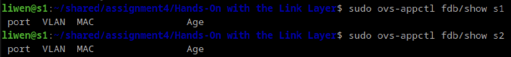
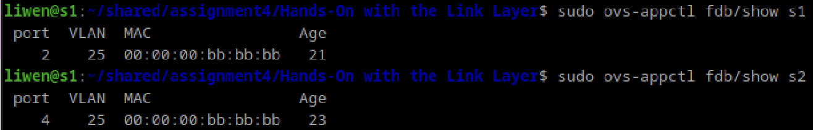
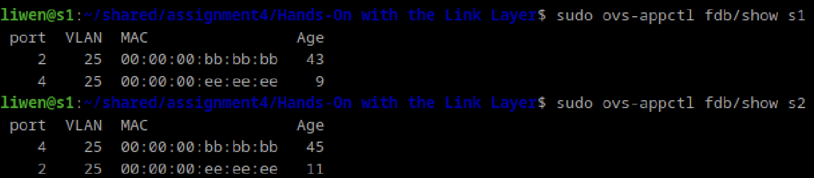
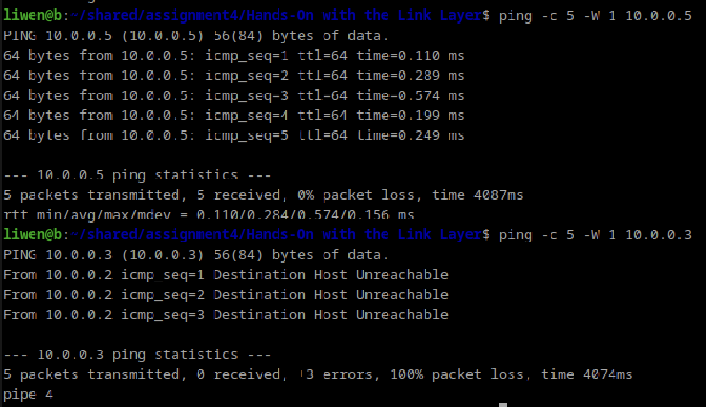
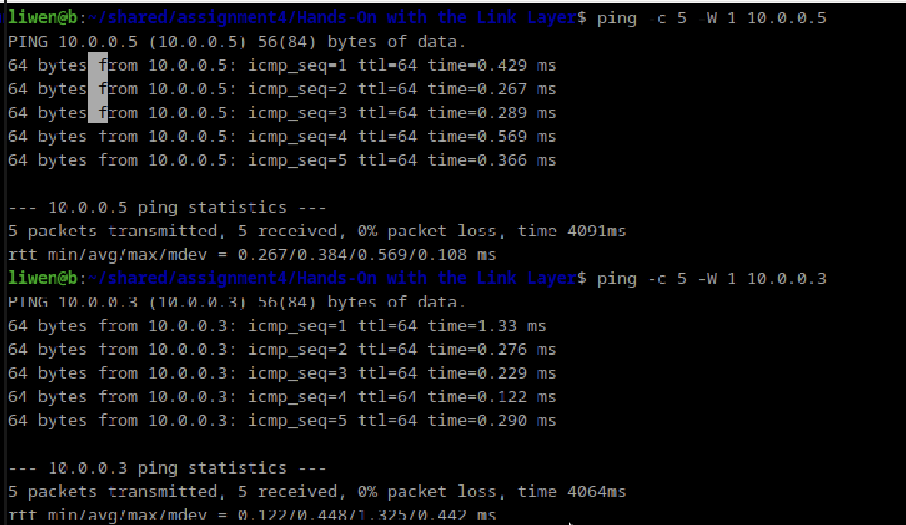

 1. `s1` MAC address tables:

Both tables are empty. 

 2. After sending a single frame from `b` to `e`, which links saw the frame from `b` to `e`?

The links that saw the frame when sending from `b` to `e` are `b-s1`, `s1-s2`, `a-s1`, `d-s2`, `e-s2`. 

 3. On which link(s) do/does the
    frame(s) include an 802.1Q frame header?  What is the value of the ID field
    in the 802.1Q header of that frame?

The 802.1Q header is only present on the link `s1-s2`. The value of the ID field of that header is `25`.
    
 4. `s1` MAC address tables:

The table of `s1` has the entry (port=2, VLAN=25, MAC=00:00:00:bb:bb:bb, age=21).

The table of `s2` has the entry (port=2, VLAN=25, MAC=00:00:00:bb:bb:bb, age=23).

 5. Which links saw the frame from `e` to `b` when a ping is sent?

The links that saw the frame are `e-s2`, `s1-s2`, `b-s1`.

 6. `s1` MAC address tables:

The table of `s1` has the following entries: (port=2, VLAN=25, MAC=00:00:00:bb:bb:bb, age=43), (port=4, VLAN=25, MAC=00:00:00:ee:ee:ee, age=9)

The table of `s2` has the following entries: (port=2, VLAN=25, MAC=00:00:00:bb:bb:bb, age=45), (port=4, VLAN=25, MAC=00:00:00:ee:ee:ee, age=11)

 7. After restarting the network, what is the difference between pinging `e` and pinging `c`?  Why is there a difference?

The difference betweening pinging `e` and `c` is that b is able to succesfully transmit the pink to `e`. However, `c` was unreachable, so we receive icmp errors conveying that the "destination host is unreachable". This is because the `b` and `c` are in different VLANs (`25` and `30` respectively), so they are unable to communicate with one another. 

8. Restart with a different variation.
    Is the outcome different than it was in the previous problem?  Why or why
    not?  Use the difference in configuration files to determine the answer.

The outcome was different than problem 7 because the ping from `b` to `c` was successful (`b` to `e` was also successful). The difference was because the host `c` was reachable because we no longer use VLANs. 

Looking at the two configuration files, the configuration in `h6-s2-vlan.cfg` has the link `s1-s2` with the `trunk` option as `true` and every single host was given a VLAN value. In `h6-s2.cfg` the `trunk` option is not specified and none of the hosts have VLAN values. This indicates that we are not using VLANs here. 
